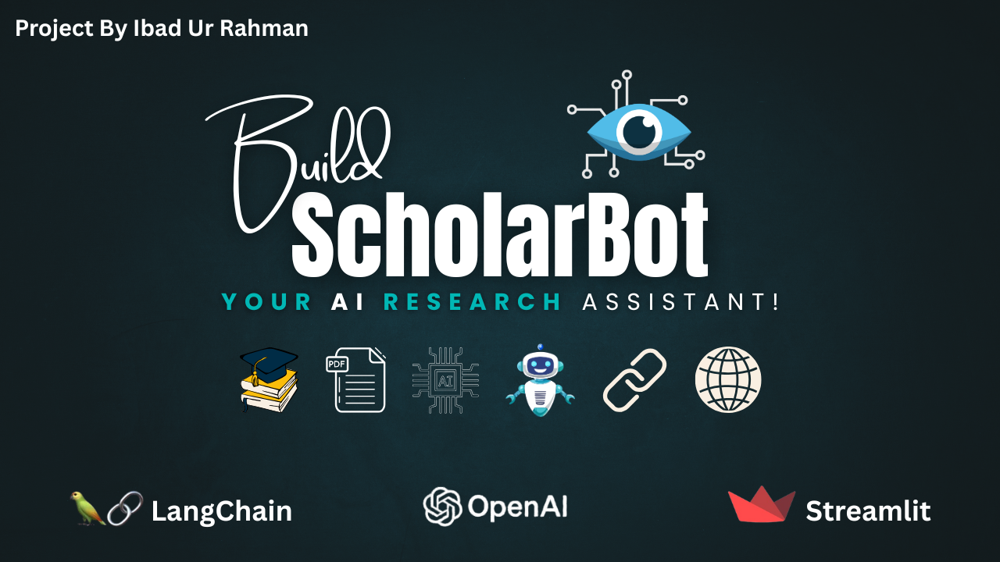
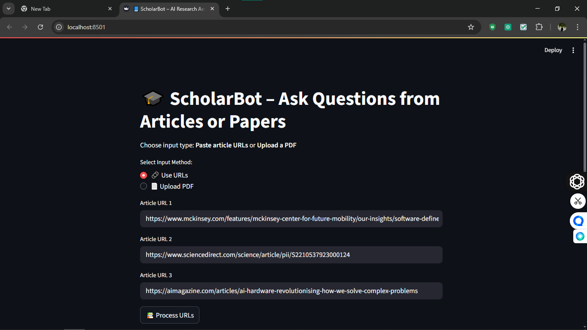
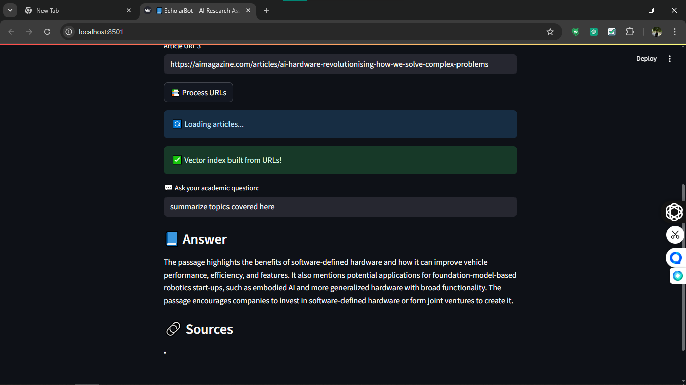

# 🎓 ScholarBot – Your AI Research Assistant


ScholarBot is a powerful yet lightweight **AI-powered research assistant** that allows users to upload **PDFs** or insert **article URLs**, then ask intelligent academic questions. It uses **OpenAI GPT-3.5**, **LangChain**, and **FAISS** to provide fast, contextual answers — with proper citations!

Whether you're a **student**, **researcher**, or a **curious learner**, ScholarBot simplifies academic exploration.

---
## 📸 Display Preview

### 🔖 Thumbnail  


### 🔗 URL Input Example  
| Input | Output |
|-------|--------|
|  |  |

---
## 🚀 Features

- ✅ Ask questions from research **PDF documents** or **URLs**
- ✅ Supports up to **3 article links** simultaneously
- ✅ Uses **OpenAI GPT-3.5 Turbo** via **LangChain**
- ✅ APA-style **citations and sources**
- ✅ Handles **large documents** using FAISS vector search
- ✅ Simple yet effective **Streamlit interface**
- ✅ Works **locally** or on **Google Colab**

---
## 🧱 Tech Stack

| Layer           | Technology                               |
|----------------|-------------------------------------------|
| 💬 LLM           | OpenAI GPT-3.5 Turbo (via LangChain)     |
| 🧠 Embeddings     | `sentence-transformers/all-MiniLM-L6-v2` |
| 📚 Doc Loader     | LangChain PDF & URL Loaders             |
| 🧮 Vector Store   | FAISS (fast semantic search)            |
| 🌐 Interface      | Streamlit                               |
| ⚙️ Framework      | LangChain                               |

---
## 🧩 Project Structure

```txt
ScholarBot/
├── assets/
│   ├── URLs_inputs.png
│   ├── URLs_Answer_1.png
│   └── Thumbnail.png
├── src/
│   ├── main.py
│   ├── requirements.txt
│   ├── .env               # Your OpenAI key (excluded from Git)
│   └── faiss_index/       # Auto-generated FAISS store
├── .gitignore
└── README.md
```
---
## 🔧 Installation & Setup

1. Clone the Repository
git clone https://github.com/YOUR_USERNAME/ScholarBot.git
cd ScholarBot/src

2. Install Python Dependencies
pip install -r requirements.txt

3. Create a .env file
# Inside src/.env
OPENAI_API_KEY=your_openai_api_key_here

▶️ Running the App Locally
streamlit run main.py
This will open the ScholarBot app in your browser at http://localhost:8501

☁️ Running on Google Colab (Optional)
You can run this app in Google Colab using ngrok to tunnel your Streamlit server.
Follow the same structure but install and use:

pip install pyngrok
Then expose Streamlit app using:

from pyngrok import ngrok
ngrok.set_auth_token("your_ngrok_token")
public_url = ngrok.connect(8501)

---
## 📚 Requirements
Your requirements.txt should include:

streamlit
python-dotenv
openai
langchain
langchain-community
sentence-transformers
faiss-cpu
PyPDF2

---
## 📜 License
Licensed under the MIT License.

---
## 🙋‍♂️ About the Author
Ibad Ur Rahman
🎓 Computer Systems Engineering – Sukkur IBA University
📬 ibadurrahmanmemon.becsef22@iba-suk.edu.pk
